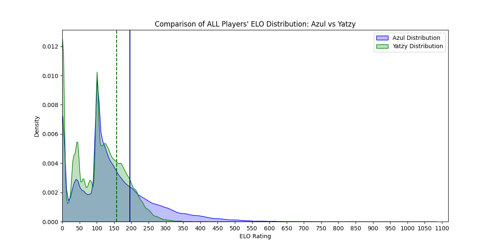
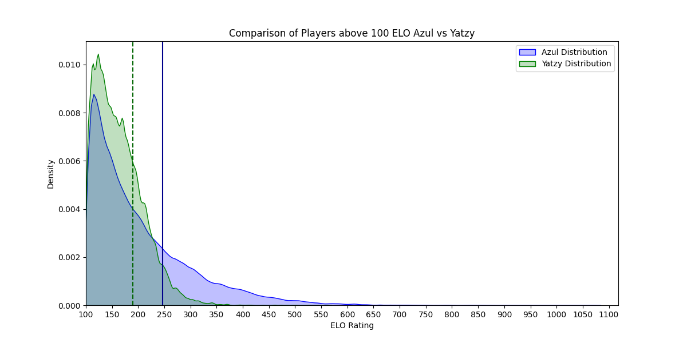
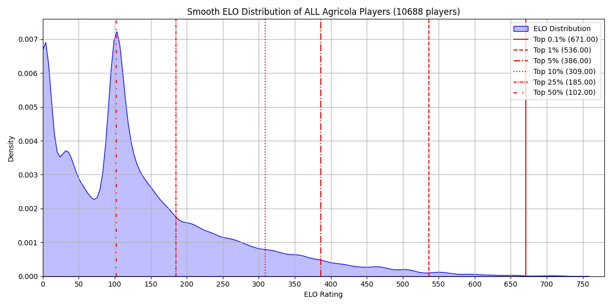
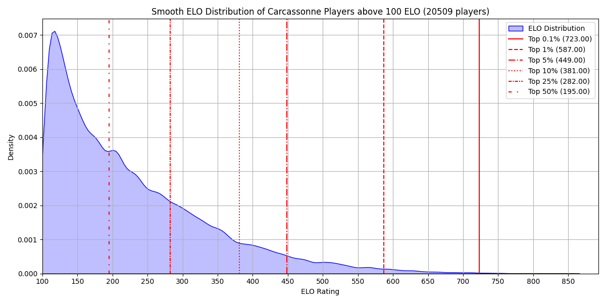
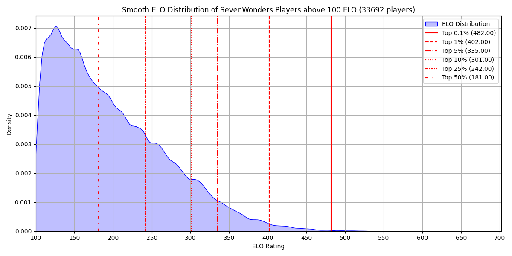
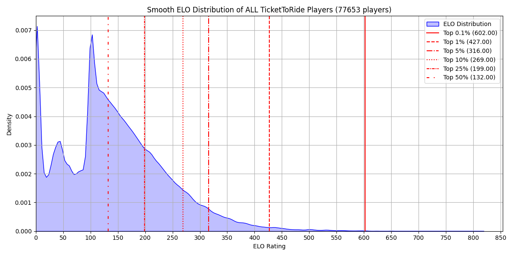
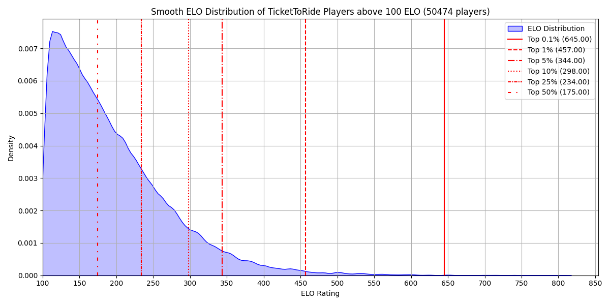
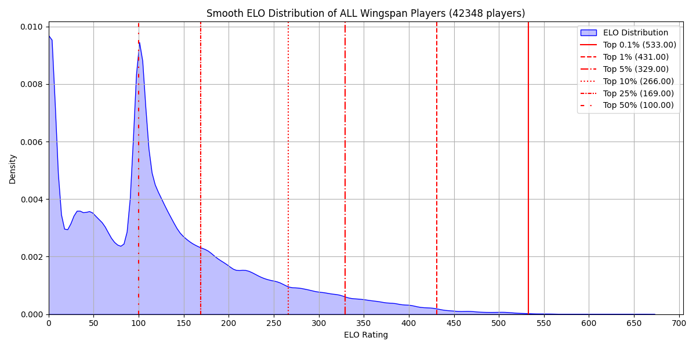

# Usage

## Setup
1. Install Google Chrome (or Chrome for Testing) locally.
2. Create and activate a virtual environment (optional but recommended).
3. Install the Python dependencies:
   ```
   pip install selenium webdriver-manager beautifulsoup4 matplotlib numpy pandas seaborn
   ```

## Download leaderboard data
1. Edit `src/scrap.py`:
   - Add any missing games in the `games_paths` dictionary.
   - Add the games you want to scrape to `list_of_games`.
2. Run the scraper:
   ```
   cd src
   python scrap.py
   ```

This opens a Chrome window via Selenium, navigates to each Board Game Arena leaderboard and downloads the “All-time” ranking. Results are stored as CSV files inside `leaderboards/<Game>_full_leaderboard.csv`.

### Troubleshooting
- **ChromeDriver download issues** – `webdriver_manager` downloads the right binary automatically, but it needs internet access and a locally installed Chrome version. If the machine cannot reach Google’s endpoints you will need to download the matching driver manually and place it inside `~/.wdm/drivers/`.
- **Exec format errors / THIRD_PARTY_NOTICES** – if a previous webdriver download cached only notice files, delete the stale folder inside `~/.wdm/drivers/chromedriver/` and re-run the scraper so a fresh executable can be fetched.

## Plot and compare results
`src/analyze_data.py` contains helpers to render smooth histograms of the collected CSV files.

- Generate figures for each game:
  ```
  cd src
  python analyze_data.py
  ```
  (call `plot_all_games()` / `compare_games()` as needed inside the script.)

- Comparison graphics are written to `comparison_results/` while single-game plots live in `results/`.

## Update this README’s gallery
Regenerate the “Results” section after producing plots by running:
```
python update_readme.py
```


# Results
### Azul
**Azul vs Yatzy all elo distribution**

**Azul vs Yatzy elo distribution**

### Agricola
**Agricola all elo distribution**

**Agricola elo distribution**

### ArkNova
**ArkNova all elo distribution**

**ArkNova elo distribution**

### Azul
**Azul all elo distribution**

**Azul elo distribution**

### Carcassonne
**Carcassonne all elo distribution**

**Carcassonne elo distribution**

### Catan
**Catan all elo distribution**

**Catan elo distribution**

### Patchwork
**Patchwork all elo distribution**

**Patchwork elo distribution**

### Quoridor
**Quoridor all elo distribution**

**Quoridor elo distribution**

### RaceForTheGalaxy
**RaceForTheGalaxy all elo distribution**

**RaceForTheGalaxy elo distribution**

### SevenWonders
**SevenWondersDuel all elo distribution**

**SevenWondersDuel elo distribution**

**SevenWonders all elo distribution**

**SevenWonders elo distribution**

### SevenWondersDuel
**SevenWondersDuel all elo distribution**

**SevenWondersDuel elo distribution**

### TicketToRide
**TicketToRide all elo distribution**

**TicketToRide elo distribution**

### Wingspan
**Wingspan all elo distribution**

**Wingspan elo distribution**

### Yatzy
**Yatzy all elo distribution**

**Yatzy elo distribution**

